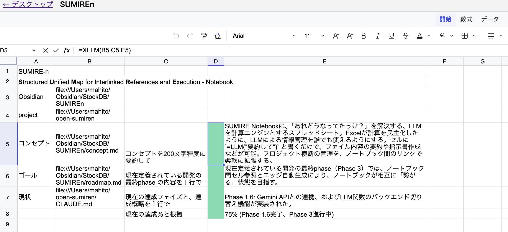

# SUMIRE-n

**LLM-powered spreadsheet for managing everything.**

Excel democratized calculation with `=SUM()`.
SUMIRE-n democratizes "what was the status of that?" with `=LLM()`.

Write `=LLM(B2, "summarize this", D2)` in a cell, press ▶, and the LLM reads your local files and writes the result back into the spreadsheet. No LLM knowledge required — just type into cells.

> **SUMIRE-n**: **S**tructured **U**nified **M**ap for **I**nterlinked **R**eferences and **E**xecution - **N**otebook

[日本語版 README はこちら](README.ja.md)



---

## Features

- **`=LLM()` in cells** — Run a local LLM (Ollama) from any cell, just like `=SUM()`
- **`=xLLM()` in cells** — Run a cloud LLM (Gemini API) for higher quality
- **File references** — Put a file path in a cell (`file:///path/to/spec.md`), and the LLM reads it automatically
- **Multiple notebooks** — Manage projects as separate `.sumiren` files
- **Desktop view** — See all notebooks at a glance (React Flow)
- **Fully local** — Your data stays on your machine. No cloud required (unless you use xLLM)

---

## Quick Start

### Prerequisites

| Software | Version | Required |
|----------|---------|----------|
| Node.js | 18+ | ✅ |
| Python | 3.12+ (tested on 3.12) | ✅ |
| Ollama | 0.18+ | ⚡ For local LLM (`=LLM()`) |
| Gemini API Key | — | ⚡ For cloud LLM (`=xLLM()`) |

You need **either** Ollama or a Gemini API key. Both are optional if you just want to explore the UI.

### 1. Clone & install

```bash
git clone https://github.com/kikyujin/open-sumiren.git
cd open-sumiren

# Frontend
cd frontend
npm install
cd ..

# Backend
cd backend
python3 -m venv .venv
source .venv/bin/activate    # Windows: .venv\Scripts\activate
pip install -r requirements.txt
cd ..
```

### 2. Set up LLM (choose one or both)

#### Option A: Local LLM with Ollama (recommended)

Install Ollama from [ollama.com/download](https://ollama.com/download), then:

```bash
# Recommended models
ollama pull gemma3:27b     # 27B — needs 16GB+ RAM, best quality
ollama pull gemma3:12b     # 12B — needs 8GB+ RAM, good balance
```

Other Ollama models may work but are untested.

No configuration needed. Ollama runs on `localhost:11434` by default.

#### Option B: Cloud LLM with Gemini API

Get a free API key from [Google AI Studio](https://aistudio.google.com/apikey), then:

```bash
cp backend/.env.example backend/.env
# Edit backend/.env and set your key:
# GEMINI_API_KEY=AIza-xxxxxxxx
```

To use Gemini for **all** LLM calls (no Ollama needed):

```bash
# In backend/.env
GEMINI_API_KEY=AIza-xxxxxxxx
LLM_BACKEND=gemini
```

### 3. Run

```bash
./run.sh
```

Or start each service separately:

```bash
# Terminal 1: Backend
cd backend
source .venv/bin/activate
uvicorn main:app --host 0.0.0.0 --port 9300 --reload

# Terminal 2: Frontend
cd frontend
npm run dev
```

Open [http://localhost:5173](http://localhost:5173) in your browser.

### 4. First steps

> **Note:** The UI is currently in Japanese. An English locale is planned for a future release.

When you open SUMIRE-n for the first time, you'll see an empty desktop. Here's how to get started:

1. **Right-click** the background → "📓 New notebook" → name it (e.g. `my-project`)
2. **Double-click** the notebook card to open the spreadsheet
3. Try this in the cells:

| | A | B | C |
|---|---|---|---|
| 1 | hello world | translate in Chinese | |
| 2 | | `=LLM(A1, B1, C1)` | |

4. Select cell **B2** (the formula cell) and click **▶ LLM実行** (top right) — C1 shows: **你好世界**
5. **Cmd+S** (or Ctrl+S) to save

**Next:** Try putting a file path in a cell (e.g. `file:///Users/you/project/README.md`) and use `=LLM()` to summarize it.

---

## How it works

### Writing LLM formulas

```
=LLM(input, "prompt", output)
```

| Part | Description |
|------|-------------|
| `input` | Cell reference(s) containing data or file paths. Multiple inputs OK |
| `"prompt"` | What to ask the LLM. Use a cell reference for Japanese text |
| `output` | Cell where the result goes. The formula stays so you can re-run |

**Examples:**

```
=LLM(B2, "summarize in one line", D2)     — Summarize B2, write to D2
=LLM(B2, B5, C2, D2)                       — Multiple inputs (B2, B5), prompt in C2, output D2
=xLLM(B2, "translate to English", D2)      — Same syntax, uses Gemini API
```

**File references:** If a cell contains a file path like `file:///Users/you/project/README.md`, the file content is automatically loaded when the LLM runs.

**Japanese prompt tip:** Due to a Univer v0.18 bug, write Japanese prompts in a separate cell and reference it, instead of putting Japanese text directly in the formula.

### Desktop & Notebooks

- **Desktop** (`/`): See all notebooks as cards. Right-click to create, rename, delete
- **Sheet** (`/notebook/{name}`): Spreadsheet view. Write formulas, press ▶ to run LLM
- Each notebook saves as a `.sumiren` file in the `data/` directory

---

## Environment Variables

| Variable | Default | Description |
|----------|---------|-------------|
| `GEMINI_API_KEY` | — | Gemini API key. Required for `=xLLM()` |
| `LLM_BACKEND` | `ollama` | Backend for `=LLM()`. Set to `gemini` to use Gemini for everything |

---

## Using a different cloud LLM

SUMIRE-n uses Gemini by default for `=xLLM()`, but you can swap it for any LLM provider by editing a single file: `backend/xllm_adapter.py`.

The file has detailed comments explaining how to swap in OpenAI, Anthropic Claude, or any other provider. The only rule: keep the function signature `generate_xllm(prompt, context) → str`.

---

## Tech Stack

| Layer | Technology |
|-------|-----------|
| Spreadsheet UI | [Univer](https://univer.ai/) 0.18 (canvas-based, Apache-2.0) |
| Desktop view | [React Flow](https://reactflow.dev/) v12 |
| Frontend | React 19, Vite 8, TypeScript |
| Backend | FastAPI 0.115, Python 3.12 |
| Local LLM | [Ollama](https://ollama.com/) |
| Cloud LLM | Google Gemini API (REST) |

---

## Project Structure

```
open-sumiren/
├── frontend/           # React + Univer + Vite
│   └── src/
│       ├── pages/      # Desktop.tsx, Sheet.tsx
│       └── components/ # NotebookNode.tsx
├── backend/            # FastAPI
│   ├── main.py         # API endpoints
│   ├── llm_adapter.py  # Ollama adapter
│   └── xllm_adapter.py # Gemini adapter (swap this for other providers)
├── data/               # Notebook files (.sumiren)
└── run.sh              # Start everything
```

---

## Roadmap

- [x] **Phase 0**: LLM in cells (Univer + FastAPI + Ollama)
- [x] **Phase 1**: Multiple notebooks, desktop view, cloud LLM, OSS release
- [ ] **Phase 2**: Chain execution, health checks, headline values
- [ ] **Phase 3**: Cross-notebook cell references, edge visualization

See [docs/roadmap.md](docs/roadmap.md) for details.

---

## License

Apache License 2.0. See [LICENSE](LICENSE).

---

## Credits

Built by [@kikyujin](https://github.com/kikyujin) with 🦊 Elmar.
